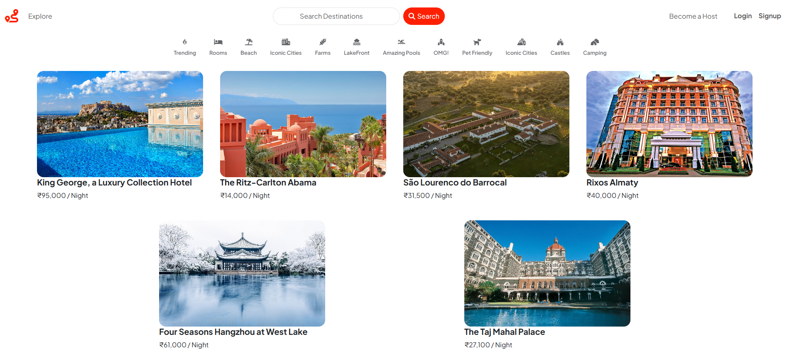
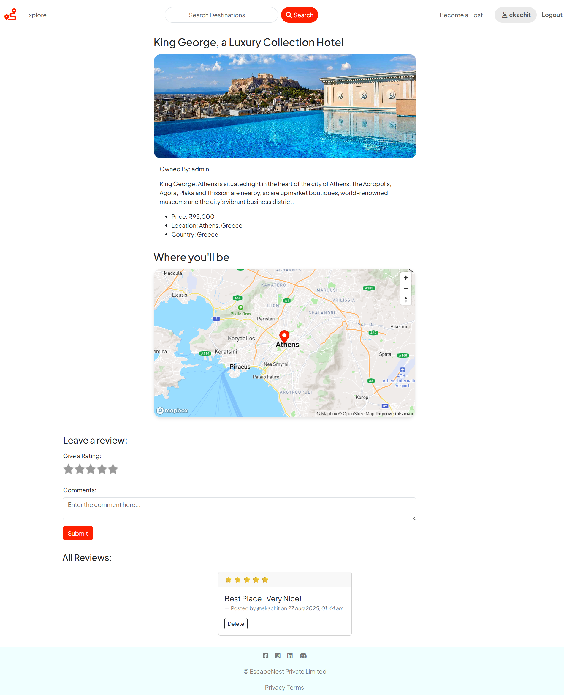
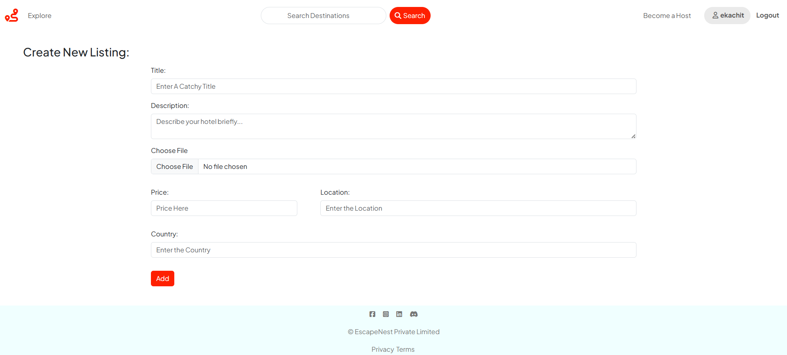

# 🏡 EscapeNest - A Full-Stack Vacation Rental Platform


EscapeNest is a feature-rich, full-stack web application inspired by Airbnb. It allows users to discover, book, and review vacation rentals around the world. The platform is built with a classic MVC architecture, ensuring a clean and scalable codebase.

**Live Demo:** [escapenest-quif.onrender.com](https://escapenest-qujf.onrender.com)

---

## 🌟 Key Features

* **RESTful Routing**: Clean and predictable API endpoints for all resources.
* **User Authentication**: Secure user registration and login functionality using Passport.js.
* **CRUD Operations**: Users can create, read, update, and delete their own rental listings.
* **Image Uploads**: Seamless image uploading for listings, hosted on Cloudinary.
* **Interactive Maps**: Property locations are displayed on an interactive map using the Mapbox API.
* **Reviews & Ratings**: Authenticated users can post reviews and ratings for listings.
* **Authorization & Middleware**: Secure routes and robust error handling to protect user data and resources.
* **Responsive UI**: A mobile-first design built with EJS and Bootstrap ensures a great experience on any device.
* **Data Validation**: Server-side schema validation using Joi to ensure data integrity before it hits the database.

---

## 🛠️ Tech Stack

| Category              | Technologies & Services                                                                  |
| --------------------- | ---------------------------------------------------------------------------------------- |
| **Frontend** | EJS (Embedded JavaScript templates), HTML5, CSS3, JavaScript, Bootstrap                  |
| **Backend** | Node.js, Express.js                                                                      |
| **Database** | MongoDB (with Mongoose)                                                                  |
| **Authentication** | Passport.js (Local Strategy), Express Sessions, Cookies                                  |
| **File Storage** | Cloudinary API                                                                           |
| **Geolocation** | Mapbox API                                                                               |
| **Architecture** | MVC (Model-View-Controller)                                                              |
| **Deployment** | Render                                                                                   |

---

## 📂 Project Structure

The project follows the Model-View-Controller (MVC) architectural pattern to ensure a clear separation of concerns.

```
├── controllers/      # Handles request logic
├── models/           # Defines database schemas (User, Listing, Review)
├── routes/           # Defines API endpoints
├── views/            # EJS templates for the UI
├── public/           # Static assets (CSS, JS, images)
├── middleware.js     # Custom middleware for auth and error handling
├── app.js            # Main application entry point
└── .env              # Environment variables
```
---

## 🚀 Getting Started

To get a local copy up and running, follow these simple steps.

### Prerequisites

* Node.js (v18 or higher)
* npm
* MongoDB (local installation or a cloud instance like MongoDB Atlas)

### Installation & Setup

1.  **Clone the repository:**
    ```sh
    git clone https://github.com/ekachitgvnarayan/EscapeNest.git
    cd EscapeNest
    ```

2.  **Install NPM packages:**
    ```sh
    npm install
    ```

3.  **Set up Environment Variables:**
    Create a `.env` file in the root directory and add the following variables. You will need to create accounts on Cloudinary and Mapbox to get API keys.

    ```env
    CLOUDINARY_CLOUD_NAME=<your_cloudinary_cloud_name>
    CLOUDINARY_API_KEY=<your_cloudinary_api_key>
    CLOUDINARY_API_SECRET=<your_cloudinary_api_secret>
    MAPBOX_TOKEN=<your_mapbox_api_token>
    MONGO_URL=<your_mongodb_connection_string>
    SESSION_SECRET=<a_strong_secret_for_session_cookies>
    ```

4.  **Run the application:**
    ```sh
    node app.js
    ```
    The application should now be running on `http://localhost:8000`.

---
## ✅ Future Enhancements

* Implement search and filter functionality for listings
* Add payment gateway integration
* Enhance responsive UI with modern CSS frameworks
* Deploy on AWS or DigitalOcean for better scalability

---
## 📸 Screenshots

**Home Page**


**Listing Details Page**


**Create New Listing**


---

## 👨‍💻 Author

**G. Ekachit Narayan Reddy**
* **GitHub:** [@ekachitgvnarayan](https://github.com/ekachitgvnarayan)
* **LinkedIn:** [g-ekachit-narayan-reddy](https://www.linkedin.com/in/g-ekachit-narayan-reddy-822888234/)
